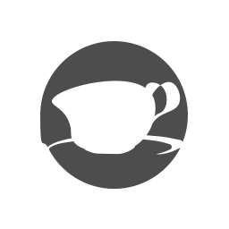

# Glass




![GitLab Contributors](https://img.shields.io/gitlab/contributors/ideal-state%2Fglass?style=flat-square&logo=data%3Aimage%2Fsvg%2Bxml%3Bcharset%3Dutf-8%3Bbase64%2CPD94bWwgdmVyc2lvbj0iMS4wIiBlbmNvZGluZz0iVVRGLTgiPz4KPHN2ZyB4bWxucz0iaHR0cDovL3d3dy53My5vcmcvMjAwMC9zdmciIHZlcnNpb249IjEuMSIgdmlld0JveD0iMCAwIDE2IDE2Ij4KICA8ZGVmcz4KICAgIDxzdHlsZT4KICAgICAgLmNscy0xIHsKICAgICAgICBmaWxsOiAjZmZmOwogICAgICB9CiAgICA8L3N0eWxlPgogIDwvZGVmcz4KICA8Zz4KICAgIDxnIGlkPSJwZW9wbGUiPgogICAgICA8cGF0aCBjbGFzcz0iY2xzLTEiIGQ9Ik0yLDUuNWMwLTEuOSwxLjYtMy41LDMuNS0zLjUsMS45LDAsMy41LDEuNiwzLjUsMy41LDAsMS0uNCwxLjktMS4xLDIuNSwxLjYuOCwyLjcsMi4zLDMsNC4xLDAsLjQtLjIuOC0uNi45LS40LDAtLjgtLjItLjktLjZoMGMtLjMtMi4yLTIuNC0zLjctNC42LTMuMy0xLjcuMy0zLDEuNi0zLjMsMy4zLDAsLjQtLjQuNy0uOS42LS40LDAtLjctLjQtLjYtLjloMGMuMy0xLjgsMS40LTMuMywzLTQuMS0uNy0uNy0xLjEtMS42LTEuMS0yLjZaTTExLDRjMS43LDAsMywxLjMsMywzLDAsLjctLjMsMS41LS44LDIsMS4yLjYsMi4yLDEuNywyLjYsMywuMS40LDAsLjgtLjUuOS0uMSwwLS4zLDAtLjQsMC0uMywwLS41LS4zLS41LS41LS40LTEuMi0xLjMtMi4xLTIuNS0yLjQtLjMsMC0uNi0uNC0uNi0uN3YtLjRjMC0uMy4yLS41LjQtLjcuNy0uNCwxLTEuMy43LTItLjMtLjUtLjgtLjgtMS4zLS44LS40LDAtLjgtLjMtLjgtLjhzLjMtLjguOC0uOFpNNS41LDMuNWMtMS4xLDAtMiwuOC0yLDIsMCwxLjEuOCwyLDIsMiwwLDAsMCwwLDAsMCwxLjEsMCwyLS45LDItMiwwLTEuMS0uOS0xLjktMi0yWiIvPgogICAgPC9nPgogIDwvZz4KPC9zdmc%2B)


### [📖 使用文档](https://docs.idealstate.team/glass/) &ensp; [📢 贡献指南](https://docs.idealstate.team/guide/contribution/)


### ☑️ 如何构建

```shell
# 1. 克隆项目到本地
git clone https://gitlab.com/ideal-state/glass.git
# 2. 进入项目根目录
cd ./glass
# 3. 构建项目
./gradlew assemble
```
